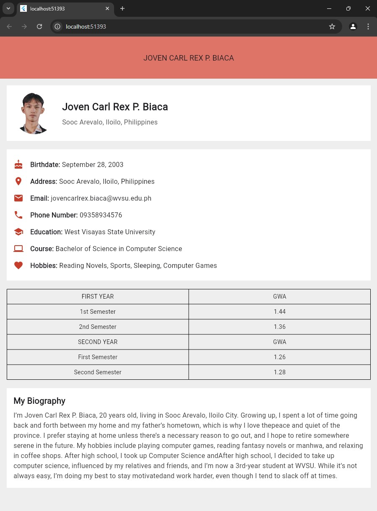

# unit4_assignment_biaca

# CC206 Assignment 6: Personal Profile App

This is a Flutter application developed as part of CC206 Assignment 6.
The app displays a personal profile page, including information about Joven Carl Rex P. Biaca. 
It contains sections for profile, education details, and a personal biography.

Features
- Profile Section: Displays a profile picture and basic information like name and address.
- Information Section: Includes key details such as birthdate, contact information, and education.
- GWA Table: Presents a structured table showcasing grades for first and second year.
- Biography Section: A short biography describing personal background and interests.

